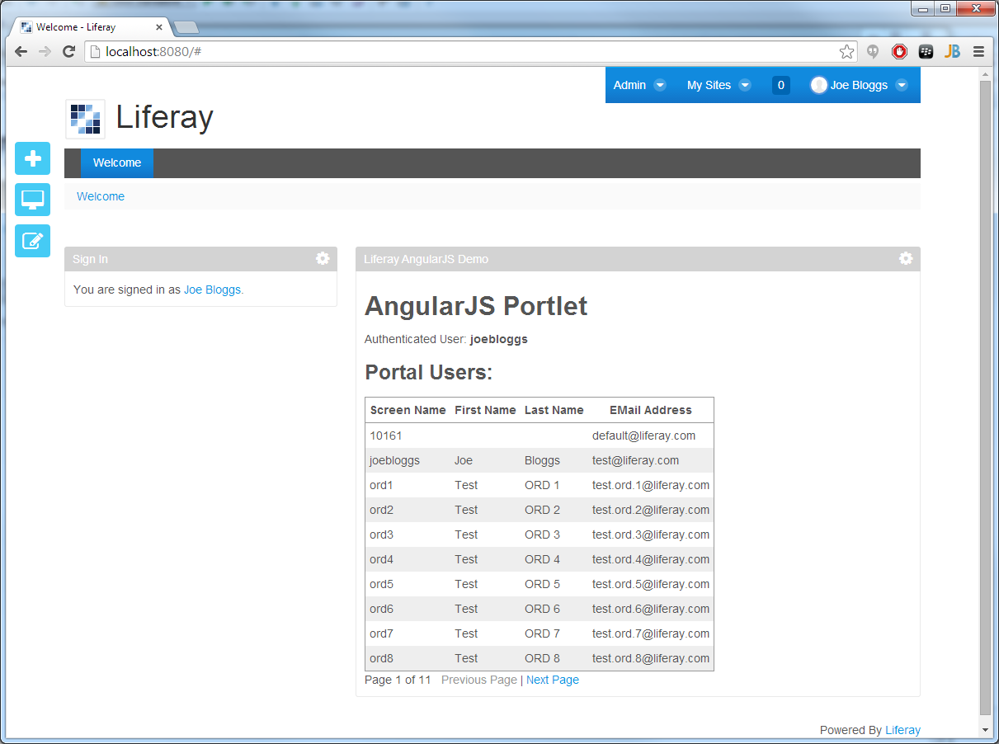
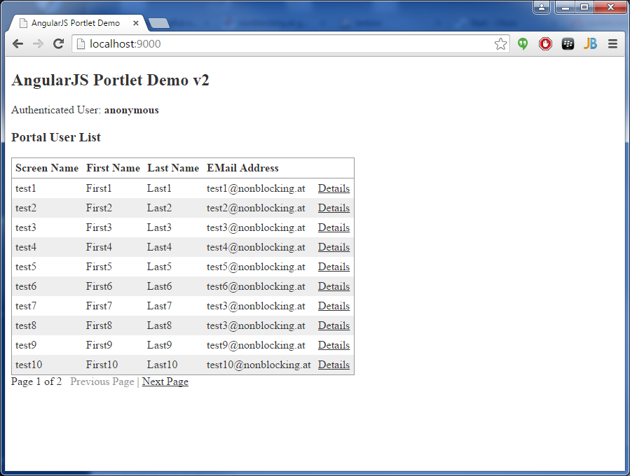

AngularJS Demo Portlet
======================

A Liferay portlet that just list all users and shows how AngularJS and Spring Portlet MVC can be used to create single page HTML5 portlets.

The demonstrator consists of two parts:

1. A [Spring Portlet MVC](http://docs.spring.io/spring/docs/4.0.x/spring-framework-reference/html/portlet.html) backend that handles all AJAX requests as resource requests. 
   It leverages the [thymeleaf](http://www.thymeleaf.org/) HTML5 template engine to pass the resource URL and other parameters as Javascript variables to the frontend. 
2. An [AngularJS](https://angularjs.org/) frontend that can also be run **standalone with node.js**, which can greatly accelerate the development.

## Build

### Prerequisites
* [Gradle](http://www.gradle.org/) build tool (should come with your favorite IDE)
* [node.js](http://nodejs.org/) to build and run the HTML5/Javascript code
* [SASS](http://sass-lang.com/) to compile the Sassy CSS into CSS

### Create a WAR file

Just run **gradle war**

## Run

### On a Liferay 6.2 Portal

Drop the generated *liferay-angularjs-portlet-\*.war* file into the *{liferay-home}/deploy* folder.

### Standalone

Run **grunt server** in the root directory of the project. The webapp will be available on *localhost:9000*.

## Notes

* To run the portlet on a Liferay 6.1 portal two files need to be changed:  
    1. In *liferay-portlet.xml* change the doctype from *6.2.0.dtd* to *6.0.0.dtd* and remove the line *\<requires-namespaced-parameters>false</requires-namespaced-parameters\>*
    2. In *liferay-plugin-package.properties* change the *liferay-versions* property to *6.1.0+,6.1.2+*
* The same AngularJS portlet can not be more than once on a portal page. In Liferay terminology a AngularjS portlet cannot be *instanceable*.
* If you plan to use more than one AngularJS portlet on a page you have to put the Javascript libraries into your theme 
  (instead of into each single portlet).
* In a real world app don't forget Java and JavaScript unit tests!

## Screenshots

### Liferay 6.2

### Standalone

